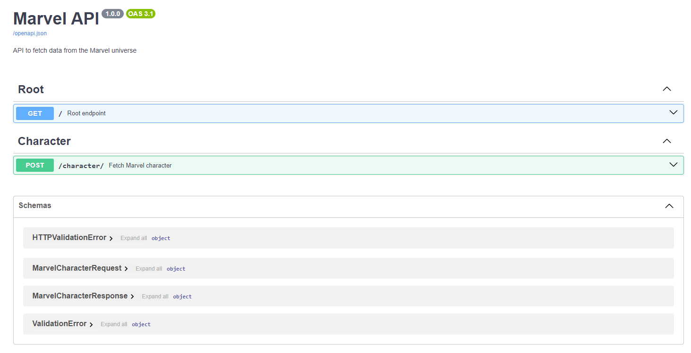

# API de Marvel con FastAPI 🚀

)


**Autor:** Diego Lerma | **Curso:** Master en Desarrollo de Microservicios con Python | **Institución:** LiteThinking

---

## ✨ Descripción

Este proyecto es una integración entre **FastAPI** y la **API de Marvel**, permitiendo obtener información en tiempo real sobre personajes de Marvel, cómics y series. La API es de alto rendimiento y ofrece respuestas en formato estructurado utilizando **modelos Pydantic**.

🔗 **Demostración en vivo:** [Documentación de la API](http://127.0.0.1:8000/docs)

---

## 📜 Características

- 🚀 **FastAPI**: Framework web de alto rendimiento para construir APIs.
- 🦸 **API de Marvel**: Recupera información en tiempo real de personajes, cómics y series de Marvel.
- ✅ **Modelos Pydantic**: Validación y serialización automática con documentación OpenAPI.
- 📝 **Ejemplos de peticiones**: Solicitudes preconstruidas para pruebas rápidas.
- 🛠 **Manejo de errores**: Manejo robusto de errores y logging detallado.

---

## 🔧 Instrucciones de configuración

### 1. Clona el repositorio

```bash
git clone https://github.com/dlerma/marvel-fastapi.git
cd marvel-fastapi
```

### 2. Crea un entorno virtual

```bash
python3 -m venv venv
source venv/bin/activate  # Para Linux/Mac
# OR
venv\Scripts\activate  # Para Windows
```

### 3. Instala las dependencias

```bash
pip install -r requirements.txt
```

### 4. Configura las variables de entorno

Crea un archivo `.env` con tus credenciales de la API de Marvel:

```bash
MARVEL_PUBLIC_KEY=tu_clave_publica
MARVEL_PRIVATE_KEY=tu_clave_privada
```

### 5. Ejecuta la aplicación

```bash
uvicorn main:app --reload
```

La API estará disponible en [http://127.0.0.1:8000](http://127.0.0.1:8000).

---

## 🛠 Endpoints

### **1. Endpoint raíz**

- **URL**: `/`
- **Método**: `GET`
- **Descripción**: Devuelve un mensaje de bienvenida.

Ejemplo de respuesta:

```json
{
  "message": "¡Bienvenido al proyecto de FastAPI x Marvel de Diego Lerma para LiteThinking!"
}
```

### **2. Obtener personaje de Marvel**

- **URL**: `/character/`
- **Método**: `POST`
- **Descripción**: Obtiene detalles de un personaje de Marvel proporcionando el nombre.
- **Cuerpo de la solicitud**:

```json
{
  "name": "Spider-Man (Miles Morales)"
}
```

Ejemplo de respuesta:

```json
{
  "id": 1016181,
  "name": "Spider-Man (Miles Morales)",
  "description": "Miles Morales creció en Brooklyn, Nueva York...",
  "thumbnail": {
    "path": "http://i.annihil.us/u/prod/marvel/i/mg/f/50/537bcfa1eed73",
    "extension": "jpg"
  }
}
```

---

## 📜 Ejemplo de Petición

Puedes usar el siguiente comando **cURL** para probar el endpoint de recuperación de personajes:

```bash
curl -X 'POST' \
  'http://127.0.0.1:8000/character/' \
  -H 'accept: application/json' \
  -H 'Content-Type: application/json' \
  -d '{
  "name": "Spider-Man (Miles Morales)"
}'
```

---

## 📚 Documentación

### OpenAPI

Visita [http://127.0.0.1:8000/docs](http://127.0.0.1:8000/docs) para acceder a la documentación interactiva **OpenAPI**, donde puedes probar la API directamente desde el navegador.



### Modelos Pydantic

**Modelo de solicitud**:

```python
class MarvelCharacterRequest(BaseModel):
    name: str = Field(..., example="Spider-Man (Miles Morales)")
```

**Modelo de respuesta**:

```python
class MarvelCharacterResponse(BaseModel):
    id: int
    name: str
    description: str
    thumbnail: dict
    resourceURI: str
    comics: dict
    series: dict
```

---

## 📈 Rendimiento

FastAPI es un framework web de alto rendimiento que permite manejar múltiples peticiones concurrentes. Este proyecto está optimizado para recuperar rápidamente datos desde la API de Marvel.

---

## 🛡 Licencia

Este proyecto está bajo la licencia **MIT**.

---

## 📬 Contacto

Si tienes alguna pregunta o comentario, no dudes en contactarme a través de [LinkedIn](https://www.linkedin.com/in/diego-lerma).

---

## 🖼 Créditos y Badges

Este proyecto utiliza:

- FastAPI como framework web
- API de Marvel para la obtención de datos

[](https://developer.marvel.com/documentation/getting_started)
[](https://fastapi.tiangolo.com/)
